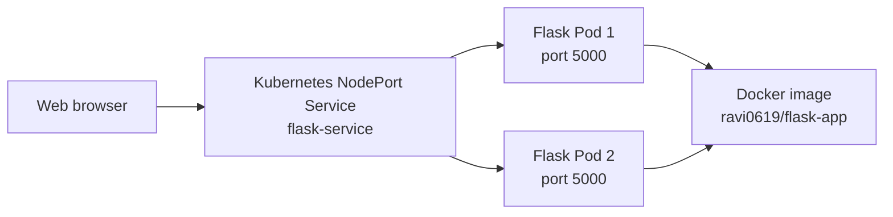

# OpsPulse Flask Application

OpsPulse is a lightweight Flask operations dashboard packaged with Docker and
deployed to Kubernetes. It displays live information from the running
application instance, including uptime, handled requests, CPU/load information,
memory usage, disk usage, hostname, environment, and application version.

The repository includes everything needed to run the application locally,
build a container image, and deploy two replicas to a Kubernetes cluster.

## Architecture



The Kubernetes service distributes requests between two application pods.
Each pod runs the Flask server on port `5000`.

## Features

- Responsive live operations dashboard
- Automatic telemetry refresh every three seconds
- Application uptime and request counter
- CPU, memory, and disk metrics
- Runtime, hostname, version, and environment information
- Kubernetes health and readiness endpoints
- Docker image configuration
- Kubernetes Deployment with two replicas
- Kubernetes NodePort Service

## Repository Structure

| File | Purpose |
| --- | --- |
| `app.py` | Flask application, telemetry API, health endpoints, and dashboard UI |
| `requirements.txt` | Python package dependencies |
| `Dockerfile` | Instructions for building the container image |
| `deployment.yaml` | Kubernetes Deployment running two Flask replicas |
| `service.yaml` | Kubernetes NodePort Service exposing the Deployment |
| `.gitignore` | Files Git should not track |

## Application Endpoints

| Endpoint | Purpose |
| --- | --- |
| `/` | OpsPulse dashboard |
| `/api/status` | Current application, runtime, and system telemetry as JSON |
| `/healthz` | Kubernetes liveness/health endpoint |
| `/readyz` | Kubernetes readiness endpoint |

Test the endpoints with:

```bash
curl http://localhost:5000/
curl http://localhost:5000/api/status
curl http://localhost:5000/healthz
curl http://localhost:5000/readyz
```

## Prerequisites

Install these tools before deploying:

- Git
- Docker Engine or Docker Desktop
- `kubectl`
- Kind

Verify the installations:

```bash
git --version
docker --version
kubectl version --client
kind version
```

On Windows, run the Linux commands in WSL when Docker and Kind are configured
there.

## Run Locally with Python

Clone the repository and enter the project:

```bash
git clone https://github.com/GaddamRavi/Flak-app.git
cd Flak-app
```

Create and activate a virtual environment:

```bash
python3 -m venv .venv
source .venv/bin/activate
pip install -r requirements.txt
```

Start Flask:

```bash
python3 app.py
```

Open:

```text
http://localhost:5000
```

On Windows PowerShell, activate the virtual environment with:

```powershell
.\.venv\Scripts\Activate.ps1
```

## Run Locally with Docker

Build the image:

```bash
docker build -t ravi0619/flask-app:v1 .
```

Run the container:

```bash
docker run --rm -p 5000:5000 \
  -e APP_NAME=OpsPulse \
  -e APP_VERSION=1.0.0 \
  -e ENVIRONMENT=local \
  ravi0619/flask-app:v1
```

Open `http://localhost:5000`.

Stop the container with `Ctrl+C`.

## Deploy to a New Machine with Kind

### 1. Clone the Repository

```bash
git clone https://github.com/GaddamRavi/Flak-app.git
cd Flak-app
```

### 2. Create a Kind Cluster

```bash
kind create cluster --name devops-lab
```

Confirm that the cluster is available:

```bash
kubectl config current-context
kubectl cluster-info
kubectl get nodes
```

The active context should be `kind-devops-lab`.

### 3. Build and Load the Image

Build the image on the new machine:

```bash
docker build -t ravi0619/flask-app:v1 .
```

Load the local image into Kind:

```bash
kind load docker-image ravi0619/flask-app:v1 --name devops-lab
```

Kind nodes run inside Docker containers. Loading the image makes it available
inside those nodes without requiring a Docker Hub push.

### 4. Deploy the Application

```bash
kubectl apply -f deployment.yaml
kubectl apply -f service.yaml
```

Wait for the rollout:

```bash
kubectl rollout status deployment/flask-app
kubectl get pods
kubectl get services
kubectl get endpoints flask-service
```

Expected resources:

- Two `flask-app` pods in `Running` state
- One `flask-service` service with type `NodePort`
- Service endpoints pointing to both pods on port `5000`

### 5. Access the Application

The most reliable way to access a Kind service from the host machine is port
forwarding:

```bash
kubectl port-forward service/flask-service 5000:80 --address=0.0.0.0
```

Keep that terminal open and visit:

```text
http://localhost:5000
```

Press `Ctrl+C` to stop port forwarding.

## Deploy Using Docker Hub

Use this approach when another machine or Kubernetes cluster must pull the
image from a registry.

Sign in to Docker Hub:

```bash
docker login
```

Build and push a versioned image:

```bash
docker build -t ravi0619/flask-app:v2 .
docker push ravi0619/flask-app:v2
```

Update the image in `deployment.yaml`:

```yaml
image: ravi0619/flask-app:v2
```

Deploy it:

```bash
kubectl apply -f deployment.yaml
kubectl apply -f service.yaml
kubectl rollout status deployment/flask-app
```

The Docker Hub repository must be public, or the Kubernetes cluster must have
an image pull secret.

## Deploy Application Updates

Use a new image tag whenever `app.py` or another application file changes.
Reusing the same tag can cause Kubernetes to continue using a cached image.

For a local Kind deployment:

```bash
docker build -t ravi0619/flask-app:v2 .
kind load docker-image ravi0619/flask-app:v2 --name devops-lab
kubectl set image deployment/flask-app flask-app=ravi0619/flask-app:v2
kubectl rollout status deployment/flask-app
```

Update `deployment.yaml` to use the same new tag so future `kubectl apply`
commands do not restore an older image.

Verify the updated application:

```bash
kubectl get pods
kubectl describe deployment flask-app
kubectl logs deployment/flask-app --tail=50
```

## Configure Application Identity

The application reads these optional environment variables:

| Variable | Default | Purpose |
| --- | --- | --- |
| `APP_NAME` | `OpsPulse` | Name displayed by the API |
| `APP_VERSION` | `1.0.0` | Application version |
| `ENVIRONMENT` | `production` | Deployment environment |

Example Kubernetes configuration:

```yaml
containers:
- name: flask-app
  image: ravi0619/flask-app:v2
  env:
  - name: APP_VERSION
    value: "2.0.0"
  - name: ENVIRONMENT
    value: "development"
```

## Useful Kubernetes Commands

```bash
# View resources
kubectl get deployments,pods,services

# View pod details
kubectl describe pod <pod-name>

# View application logs from all Deployment pods
kubectl logs deployment/flask-app --all-pods=true

# Restart the Deployment
kubectl rollout restart deployment/flask-app

# Watch a rollout
kubectl rollout status deployment/flask-app

# View rollout history
kubectl rollout history deployment/flask-app

# Roll back the previous Deployment revision
kubectl rollout undo deployment/flask-app

# Scale the application
kubectl scale deployment/flask-app --replicas=3

# Remove application resources
kubectl delete -f service.yaml
kubectl delete -f deployment.yaml

# Delete the complete local Kind cluster
kind delete cluster --name devops-lab
```

## Troubleshooting

### `localhost:30750` Does Not Open

A Kind NodePort is exposed on the Kind node container, not automatically on
the host machine. Use port forwarding:

```bash
kubectl port-forward service/flask-service 5000:80 --address=0.0.0.0
```

Then open `http://localhost:5000`.

### `kubectl` Connects to the Wrong Cluster

List contexts:

```bash
kubectl config get-contexts
```

Select the Kind cluster:

```bash
kubectl config use-context kind-devops-lab
```

### Pods Show `ImagePullBackOff`

For a local Kind image:

```bash
kind load docker-image ravi0619/flask-app:v1 --name devops-lab
kubectl rollout restart deployment/flask-app
```

For a registry image, confirm that the tag exists on Docker Hub and that the
cluster can access it.

### Service Has No Endpoints

```bash
kubectl get pods --show-labels
kubectl get endpoints flask-service
```

The pods must have the label `app=flask-app`, matching the selector in
`service.yaml`.

### Check the Application from Inside the Cluster

```bash
kubectl run curl-test --rm -it \
  --image=curlimages/curl \
  --restart=Never \
  -- http://flask-service/healthz
```

### View Container Errors

```bash
kubectl logs deployment/flask-app --tail=100
kubectl describe deployment flask-app
```

## Production Considerations

This project is suitable for learning and demonstrations. Before using it for a
production workload, consider:

- Running Flask behind Gunicorn instead of the development server
- Adding Kubernetes liveness and readiness probes to `deployment.yaml`
- Defining CPU and memory requests and limits
- Using an Ingress controller with TLS
- Pinning Python dependency versions
- Running the container as a non-root user
- Adding automated tests and CI/CD
- Publishing immutable, versioned Docker image tags

## Git Workflow

After making changes:

```bash
git status
git add .
git commit -m "Describe the change"
git push origin main
```

Repository: [GaddamRavi/Flak-app](https://github.com/GaddamRavi/Flak-app)
